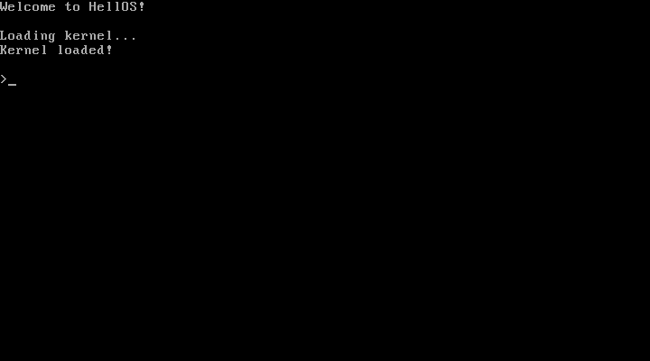

# HellOS

`HellOS` stands for "Hello, OS!". As its name suggests, it is an OS for learning and practice.

## Roadmap

* 16-bit real mode:
    * Bootloader OS (MBR)
        * ✓ Print Hello 
        * ✓ Process keyboard input (Echo, Reboot, Shutdown)
        * ✓ Two-stage loader
        * ✓ Load kernel file
            * ✓ Print Hello
            * ✓ Process keyboard input
    * Disk OS (in C language)
        * Override BIOS services
            * VGA text mode driver (replace int 10h)
            * PS/2 keyboard driver (replace int 16h)
            * ACPI driver (replace int 15h and int 19h)
        * File system driver
            * Disk driver (replace int 13h)
            * FAT 12/16/32 driver
        * Implement a simple shell
        * Implement Tetris game (0xB8000 text mode or 0xA0000 graphic mode)
* 16-bit protected mode
    * Print Hello in Ring 3
    * Process I/O interrupts
    * Override BIOS/UEFI services
    * HAL and System calls, implement Display/Keyboard/ACPI APIs
    * File system driver and file APIs
    * Implement a simple shell
    * Implement Tetris game
    * Multiple processes/threads
        * Cooperative Multitasking
        * Preemptive multitasking
* 32-bit protected mode
    * (almost same as in '16-bit protected mode', pay attention to memory paging)
* UEFI Support
* 64-bit long mode
    * (almost same as in '32-bit protected mode', pay attention to 32-bit compatibility mode)
